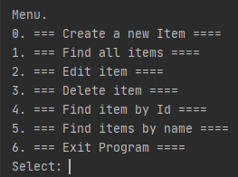
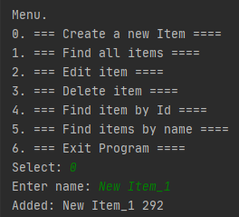
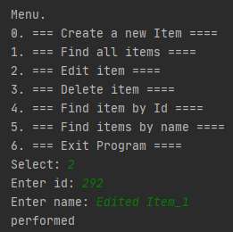
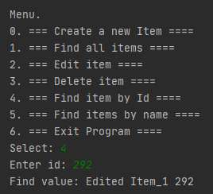
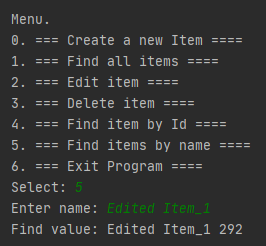
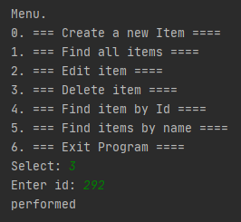

[](https://travis-ci.org/VadimShein/job4j_tracker)

# <p align="center">Приложение для хранения заявок</p>

## Описание:
Консольное приложение для хранения заявок. 
Заявки можно создавать, редактировать, удалять или искать по имени и id.
Данные хранятся в базеданных, доступ к которым осуществляется через Hibernate или JDBC. 


## Используемые технологии:
* Java 13
* PosgreSQL, Hibernate, Liquibase
* Maven


## Скриншоты:
1. Меню выбора действий.



2. Создание заявки



3. Редактирование заявки



4. Поиск заявки по id



5. Поиск заявки по имени



6 Удаление заявки



## Запуск проекта:
1. Скопировать проект 
```
git clone https://github.com/VadimShein/job4j_tracker
```

2. Создать базу данных tracker и таблицы создаются через liquibase или вручную  из файла src/main/resources/db/create.sql


3. Собрать проект
```
mvn clean package -DskipTests
```
4. Запустить приложение
```
java -jar target/job4j_tracker-1.0.jar
```


## Контакты:
[](https://t.me/SheinVadim)
[](mailto:shein.v94@mail.ru)
